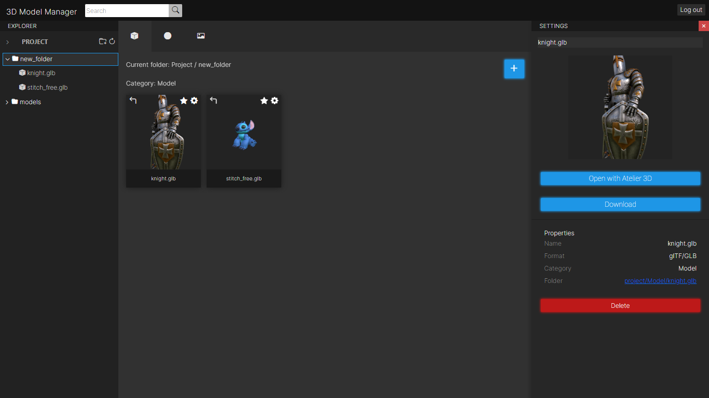

# 3D Model Manager

A web application for managing and organizing models and assets for 3D scenes. Developed using Angular and Spring Boot. It utilizes [Amazon S3](https://aws.amazon.com/s3/) for storing files and [Amazon RDS](https://aws.amazon.com/rds/) with MySQL for the database. The deployment is done with Docker on [Render](https://render.com/).

Live:
[https://assets-frontend.onrender.com](https://assets-frontend.onrender.com)

### Build
`git clone https://github.com/rigibon2/3d-asset-manager.git`\
`cd 3d-asset-manager && cd frontend`\
`ng serve --open`\
`cd .. && cd backend`\
`mvn spring-boot:run`

### TODO

* Fix a lot of bugs
* Prod too slow